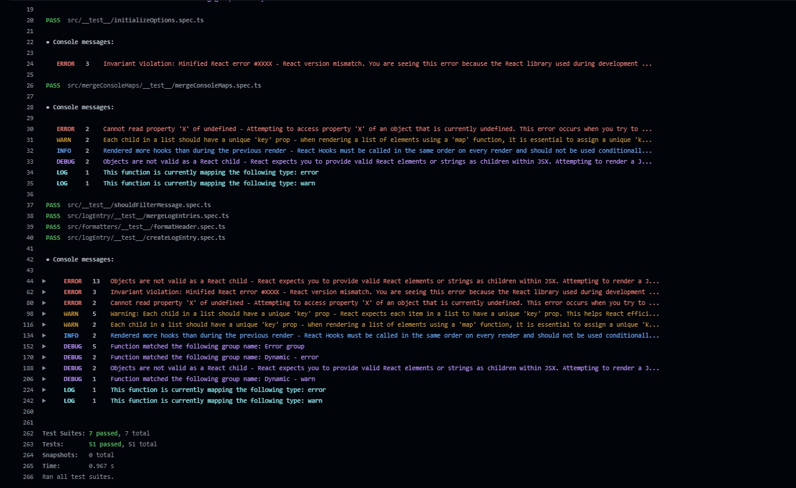

# jest-console-group-reporter



A custom Jest reporter that groups console messages, offers message filtering, and provides flexible display configuration options.

- Written in Typescript
- Supports displaying in GitHub Actions
- Provides configuration types for type safety

## Installation

You can install `jest-console-group-reporter` using your preferred package manager:

```bash
# npm
npm install jest-console-group-reporter -D

# yarn
yarn add jest-console-group-reporter -D

# pnpm
pnpm add jest-console-group-reporter -D
```

## Usage

#### Basic configuration

To use jest-console-group-reporter with the default configuration, simply add it to your Jest configuration:

```ts
// jest.config.js
module.exports = {
  // other jest config
  reporters: ["jest-console-group-reporter"],
};
```

#### Filtering console messages

You can filter specific console messages by providing string, regular expression, or predicate function in the `filters` option:

```ts
// jest.config.js

const filters = [
  // using a string
  "error",
  // Using a regex expression
  /^error/,
  // Using a predicate function
  ({ type }) => type === "error",
];

module.exports = {
  // ...other Jest configuration
  reporters: [["jest-console-group-reporter", { filters }]],
};
```

#### Grouping console messages

You can create custom message groups by specifying them in the `groups` option:

```ts
// jest.config.js

const groups = [
  {
    name: "React console messages",
    match: /react/,
  },
  // Add more custom groups as needed
];

module.exports = {
  // ...other Jest configuration
  reporters: [["jest-console-group-reporter", { groups }]],
};
```

#### Dynamic group names

You can create custom message groups by specifying them in the `groups` option:

```ts
// jest.config.js

const groups = [
  {
    name: ({ type }) => `React console.${type}`,
    match: /react/,
  },
  // Add more custom groups as needed
];

module.exports = {
  // ...other Jest configuration
  reporters: [["jest-console-group-reporter", { groups }]],
};
```

### Configuration

Default configuration:

```ts
const defaultOptions: Options = {
  consoleLevels: ["error", "warn", "info", "debug", "log"],
  filters: [],
  groups: [],
  afterEachTest: {
    enabled: true,
    reportType: "summary",
    filePaths: false,
  },
  afterAllTests: {
    reportType: "detailed",
    enabled: true,
    filePaths: true,
  },
  useGitHubActions: false,
};
```

Here are the available configuration options for `jest-console-group-reporter`:

- `filters`: An array of regular expressions, strings, or functions to filter out console messages.
  <details>
    <summary>Type decleration</summary>

  ```ts
  interface ConsoleMessage {
    type: string;
    message: string;
    origin: string;
  }

  type Matcher = string | RegExp | (({ type, message, origin }: ConsoleMessage) => boolean);

  type Filters = Array<Matcher>;
  ```

  </details>

- `groups`: An array of custom groups, where each group has a `name` and a `match` property. Messages matching the `match` criteria will be grouped under the specified `name`.
  <details>
    <summary>Type decleration</summary>

  ```ts
  interface ConsoleMessage {
    type: string;
    message: string;
    origin: string;
  }

  type Matcher = string | RegExp | (({ type, message, origin }: ConsoleMessage) => boolean);

  type Groups = Array<{
    match: Matcher;
    name: string | (({ type, message, origin }: ConsoleMessage) => string);
  }>;
  ```

  </details>

- `consoleLevels`: An array of console message types to capture (e.g., 'log', 'warn', 'error').
  <details>
    <summary>Type decleration</summary>

  ```ts
  type ConsoleLevels = string[];
  ```

  </details>

- `afterEachTest`: Configuration for displaying messages after each test.

  - `enabled` (boolean): Enable or disable displaying messages after each test.
  - `filePaths` (boolean): Include file paths in the report.
  - `reportType` ("summary" | "detailed"): Choose between "summary" and "detailed" report types <br>
  <br>
  <details>
      <summary>Type decleration</summary>

  ```ts
  interface DisplayOptions {
    enabled: boolean;
    filePaths: boolean;
    reportType: "summary" | "detailed";
  }
  ```

  </details>

- `afterAllTests`: Configuration for displaying messages after all tests have run.

  - `enabled` (boolean): Enable or disable displaying messages after all tests.
  - `filePaths` (boolean): Include file paths in the report.
  - `reportType` ("summary" | "detailed"): Choose between "summary" and "detailed" report types.
  <br>
  <br>
  <details>
        <summary>Type decleration</summary>

  ```ts
  interface DisplayOptions {
    enabled: boolean;
    filePaths: boolean;
    reportType: "summary" | "detailed";
  }
  ```

  </details>

- `useGitHubActions` (boolean): Enable GitHub Actions specific behavior. This will wrap each console message in dropdown.
  <details>
    <summary>Type decleration</summary>

  ```ts
  type UseGithubActions = boolean;
  ```

  </details>

Customize these options in your Jest configuration to tailor the reporter's behavior to your project's needs.

### Summary Reporter

The jest-console-group-reporter internally uses a summary reporter provided by Jest to display the overall test summary. You do not need to explicitly pass this summary reporter to the reporter options, as it is automatically integrated into the jest-console-group-reporter.
