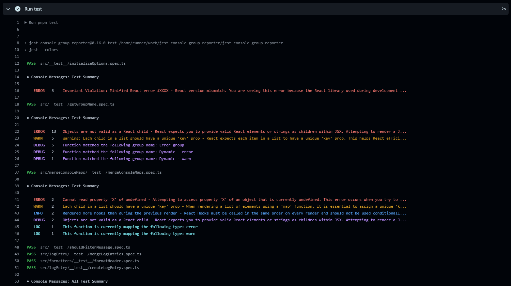

# jest-console-group-reporter

A Jest reporter that groups console messages, allows filtering, and provides flexible display configuration options.



- Written in Typescript
- Supports displaying in GitHub Actions
- Provides configuration types for type safety

## Table of Contents

- [Installation](#installation)
- [Usage](#usage)
  - [Basic configuration](#basic-configuration)
  - [Filtering console messages](#filtering-console-messages)
  - [Grouping console messages](#grouping-console-messages)
  - [Dynamic group names](#dynamic-group-names)
  - [Configuration](#configuration)
    - [filters](#filters)
    - [groups](#groups)
    - [consoleLevels](#consolelevels)
    - [afterEachTest](#aftereachtest)
    - [afterAllTests](#afteralltests)
    - [useGitHubActions](#usegithubactions)
  - [Summary Reporter](#summary-reporter)
- [Known issues](#known-issues)

## Installation

You can install `jest-console-group-reporter` using your favourite package manager:

```bash
# npm
npm install jest-console-group-reporter -D
# yarn
yarn add jest-console-group-reporter -D
# pnpm
pnpm add jest-console-group-reporter -D
```

Minumum requirements:

- Jest 25.1 or later
- Node.js 16 or later

## Usage

### Basic configuration

To use jest-console-group-reporter with the default configuration, simply add it to your Jest configuration:

```ts
// https://www.npmjs.com/package/is-ci
const isCI = require("is-ci");

// Add the reporter to your jest config
module.exports = {
  // ...
  reporters: [["jest-console-group-reporter", { useGithubActions: isCI }]],
};
```

### Filtering console messages

You can filter specific console messages by providing a string, regular expression, or predicate function in the `filters` option:

```ts
// Add as many as you like!
const filters = ["error", /^react/];

module.exports = {
  // ...
  reporters: [["jest-console-group-reporter", { filters }]],
};
```

### Grouping console messages

You can create custom message groups by specifying them in the `groups` option:

```ts
// Add as many as you like!
const groups = [
  {
    name: "React console messages",
    match: /react/,
  },
];

module.exports = {
  // ...
  reporters: [["jest-console-group-reporter", { groups }]],
};
```

### Dynamic group names

You can create custom message groups by specifying them in the `groups` option:

```ts
const groups = [
  {
    name: ({ type }) => `React console.${type}`,
    match: /react/,
  },
];

module.exports = {
  // ...
  reporters: [["jest-console-group-reporter", { groups }]],
};
```

### Configuration

Default configuration:

```ts
const defaultOptions: Options = {
  consoleLevels: ["error", "warn", "info", "debug", "log"],
  filters: [],
  groups: [],
  afterEachTest: {
    enabled: true,
    reportType: "summary",
    filePaths: false,
  },
  afterAllTests: {
    reportType: "detailed",
    enabled: true,
    filePaths: true,
  },
  useGitHubActions: false,
};
```

Here are the available configuration options:

### filters

An array of regular expressions, strings, or functions to filter out console messages.

  <details>
    <summary>Type declaration</summary>

```ts
interface ConsoleMessage {
  type: string;
  message: string;
  origin: string | undefined;
}

type Filters = Array<string | RegExp | ((consoleMessage: ConsoleMessage) => boolean)>;
```

  </details>

##### Using a predicate function

When using a predicate function, the return type must be a `boolean`.

**Note: The origin is not available for all types of console message. So you will need to test it before using it.**

```ts
interface ConsoleMessage {
  origin: string;
  type: string | undefined;
  message: string;
}

const filters = [
  ({ message }: ConsoleMessage) => message === "react",
  ({ origin }: ConsoleMessage) => origin && origin.match(/node_modules/),
  ({ type }: ConsoleMessage) => type === "error",
];

module.exports = {
  // ...
  reporters: [["jest-console-group-reporter", { filters }]],
};
```

### groups

An array of custom groups, where each group has a `name` and `match` property. Messages matching the `match` criteria will be grouped under the specified `name`.

**Note: The origin is not available for all types of console message. So you will need to test it before using it.**

  <details>
    <summary>Type declaration</summary>

```ts
interface ConsoleMessage {
  type: string;
  message: string;
  origin: string;
}

type Matcher = string | RegExp | (({ type, message, origin }: ConsoleMessage) => boolean);

type Groups = Array<{
  match: Matcher;
  name: string | (({ type, message, origin }: ConsoleMessage) => string);
}>;
```

  </details>

#### Using a predicate function

```ts
interface ConsoleMessage {
  origin: string;
  type: string | undefined;
  message: string;
}

const groups = [
  {
    name: "React warnings",
    match: ({ message, type }: ConsoleMessage) => message.match(/react/) && type === "warn",
  },
  {
    name: "Error from some module",
    match: ({ origin }: ConsoleMessage) => origin && origin.match(/some_module/),
  },
];

module.exports = {
  // ...
  reporters: [["jest-console-group-reporter", { groups }]],
};
```

### consoleLevels

An array of console message types to capture (e.g., 'log', 'warn', 'error').

  <details>
    <summary>Type declaration</summary>

```ts
type ConsoleLevels = string[];
```

  </details>

#### Example of only capturing error and warning messages

```ts
const consoleLevels = ["error", "warn"];

module.exports = {
  // ...
  reporters: [["jest-console-group-reporter", { consoleLevels }]],
};
```

### afterEachTest

Configuration for displaying messages after each test.

  <details>
      <summary>Type declaration</summary>

```ts
interface DisplayOptions {
  enabled: boolean;
  filePaths: boolean;
  reportType: "summary" | "detailed";
}
```

  </details>
<br>

- `enabled` (boolean): Enable or disable displaying messages after each test.
- `filePaths` (boolean): Include file paths in the report.
- `reportType` ("summary" | "detailed"): Choose between "summary" and "detailed" report types

#### Disable displaying summary report after each test

```ts
const afterEachTest = {
  enable: false;
}

module.exports = {
  // ...
  reporters: [["jest-console-group-reporter", { afterEachTest }]],
};
```

### afterAllTests

Configuration for displaying messages after all tests have run.

<details>
  <summary>Type declaration</summary>

```ts
interface DisplayOptions {
  enabled: boolean;
  filePaths: boolean;
  reportType: "summary" | "detailed";
}
```

  </details>
<br>

- `enabled` (boolean): Enable or disable displaying messages after all tests.
- `filePaths` (boolean): Include file paths in the report.
- `reportType` ("summary" | "detailed"): Choose between "summary" and "detailed" report types.

#### Disable displaying filePaths

```ts
const afterAllTest = {
  filePaths: false;
}

module.exports = {
  // ...
  reporters: [["jest-console-group-reporter", { afterAllTest }]],
};
```

### useGitHubActions

Enable GitHub Actions specific behavior. This will wrap each console message in a dropdown. You will only want to enable this property when running in github actions.

  <details>
    <summary>Type declaration</summary>

```ts
type UseGithubActions = boolean;
```

  </details>

#### Using the is-ci package

```ts
/**
 * @see https://www.npmjs.com/package/is-ci
 */
const isCI = require("is-ci");

module.exports = {
  // ...
  reporters: [["jest-console-group-reporter", { useGithubActions: isCI }]],
};
```

#### Using a process.env variable

```ts
const useGithubActions = process.env.IS_CI;

module.exports = {
  // ...
  reporters: [["jest-console-group-reporter", { useGithubActions }]],
};
```

## Summary Reporter

The jest-console-group-reporter internally uses a summary reporter provided by Jest to display the overall test summary. You do not need to explicitly pass this summary reporter to the reporter options, as it is automatically integrated into the jest-console-group-reporter.

## Known issues

When running Jest with for a single file (e.g. jest src/someFile.js), the reporter is not activated. This seems to be bug with Jest and not this reporter :)
